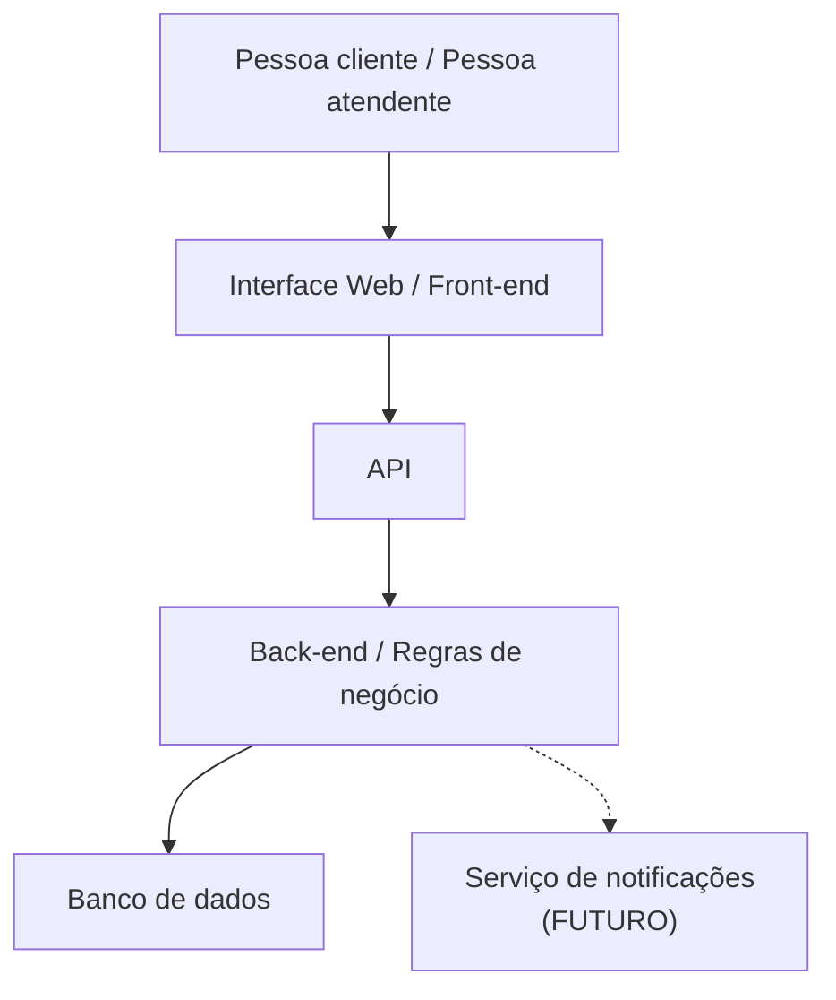

# Diagrama Arquitetural - Sistema de Gestão de Chamados

## Visão geral

A arquitetura proposta separa a interface da aplicação, a comunicação por meio da API, as regras de negócio do back-end e o armazenamento dos dados no banco de dados.

O fluxo principal de comunicação ocorre da pessoa usuária até o banco de dados, seguindo as camadas da aplicação.

## Diagrama

## Responsabilidade dos componentes

### Pessoa usuária

Representa as pessoas clientes e atendentes que utilizam o sistema.

A pessoa cliente pode registrar e acompanhar seus chamados. A pessoa atendente pode consultar, atualizar e encerrar chamados.

### Interface Web / Front-end

É responsável pela interação com as pessoas usuárias.

Entre suas responsabilidades estão apresentar as telas, receber os dados preenchidos e apresentar os resultados das operações realizadas.

### API

É o ponto de comunicação entre a interface web e o back-end.

A API recebe as solicitações enviadas pela interface e encaminha as operações para o back-end, retornando os resultados para a interface.

### Back-end / Regras de negócio

É responsável por processar as solicitações e aplicar as regras de negócio do sistema.

Entre as regras estão as permissões de cada perfil, as validações dos chamados e a sequência dos status:

**Aberto → Em andamento → Encerrado**

O back-end também realiza a comunicação com o banco de dados.

### Banco de dados

É responsável pelo armazenamento das informações do sistema, incluindo dados de clientes, atendentes e chamados.

### Serviço de notificações - FUTURO

Representa uma possível evolução da aplicação.

Esse componente poderá ser utilizado futuramente para enviar notificações relacionadas às alterações dos chamados.

Ele está marcado como **FUTURO** porque não faz parte do escopo da primeira versão.

## Fluxo principal de comunicação

A comunicação principal segue esta sequência:

**Pessoa usuária → Interface Web → API → Back-end → Banco de dados**

Quando uma operação exige armazenamento ou consulta de informações, o back-end realiza a comunicação com o banco de dados.

A interface não acessa o banco de dados diretamente. As regras de negócio também não ficam na interface, sendo responsabilidade do back-end.

Essa separação permite que os componentes tenham responsabilidades distintas e facilita futuras alterações em uma camada sem afetar diretamente as demais.
